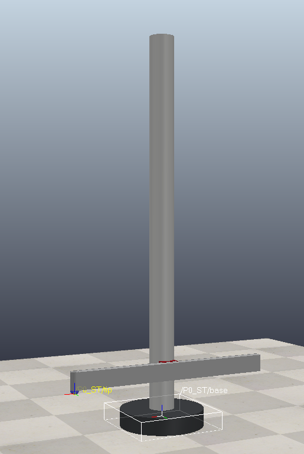

# cylindrical_robot_arm

Uma simulação de um robô cilíndrico no CoppeliaSim. Projeto final da matéria de manipuladore robóticos da especilização em robótica da UFV.

[Tarefas do projeto](doc/project_guideline.pdf)

[Vídeo explicativo](https://youtu.be/5Y4MxMDjVys)

[Resultados](<doc/Projeto Final - Manipuladores Robóticos.pdf>)

Robot model: 

